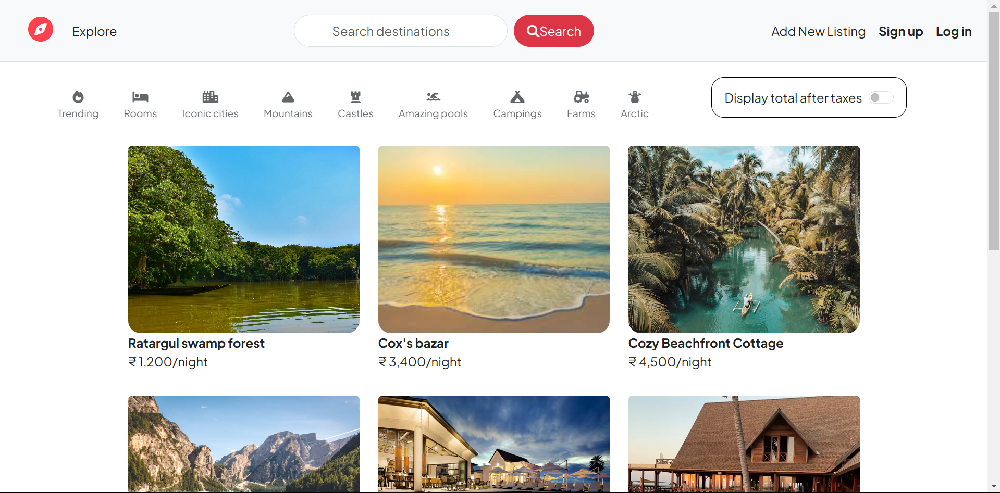

# Wandelust
This is a desktop web application, built to list any place as a vacation rental place. User can login, signup and add thier places with description, title, images and price. 
Moreover, users can add their reviews with starts as well and can see the places' locations on a map.


## Technologies & tools
- Express.js for backend
- MongoDB as Database
- Vanilla css & html for frontend
- git & gitHub


## Installation
To run the project locally, go through the following steps:

### 1. Clone the repo: <br/>
     git clone https://github.com/MdMahdiHasanTazelly/wanderlust
    
### 3. Navigate to the main project directory <br/>
       cd wanderlust 

### 4. Install all the dependencies. <br/>
      npm intall

### 5. Set up environmental variables. <br/>
   - Go to cloudinary dashboard/Account settings/Account <br/>
       `CLOUD_NAME=your_cloudinary_cloud_name`
   - Select API Key from the API Keys section of dashboard <br/>
       `CLOUD_API_KEY=your_cloudinary_api_key`
   - Get cloud API secret. Click the eye icon and do the required steps. <br/>
       `CLOUD_API_SECRET=yout_cloudinary-api_secret`
   - Get the map token from mapbox to use map. You'll simply get it as "Default public token" in the mapbox dashboard. <br/>
      `MAP_TOKEN=your_mapbox_token`
   - Get Mongo Atlas URL from you atlas dashboard <br/>
      `ATLASDB_URL=ypur_mongoAtlas_URL`
   - Add salt to the session ID. <br/>
     `SECRET=set_as_your_wish`


## Usage on local machine:
Open a tab from your browser, paste the below URL and press enter and here we go! <br/>
   `http://localhost:8080/listings`  <br/>
Now you can signup, login and add listings.


## Do you want to contribute on this project?
contributons are most welcomed!
- Fork the project.
- Create another branch for your feature. <br/>
   ```bash
    git checkout -b your_branch_name
- Now, commit your changes. <br/>
  ```bash
    git add . 
    git commit -m "feature_name" 
- Push to your branch. <br/>
  ```bash
  git push origin your_branch_name
- Open a pull request in gitHub.  


## Screenshots

   ### Home page
    

   ### Login & Signup page
   
   
   
   ### Add new listing page
   

   ### Listings Hero section
   

   ### Ratings
   

   ### Map 
   

